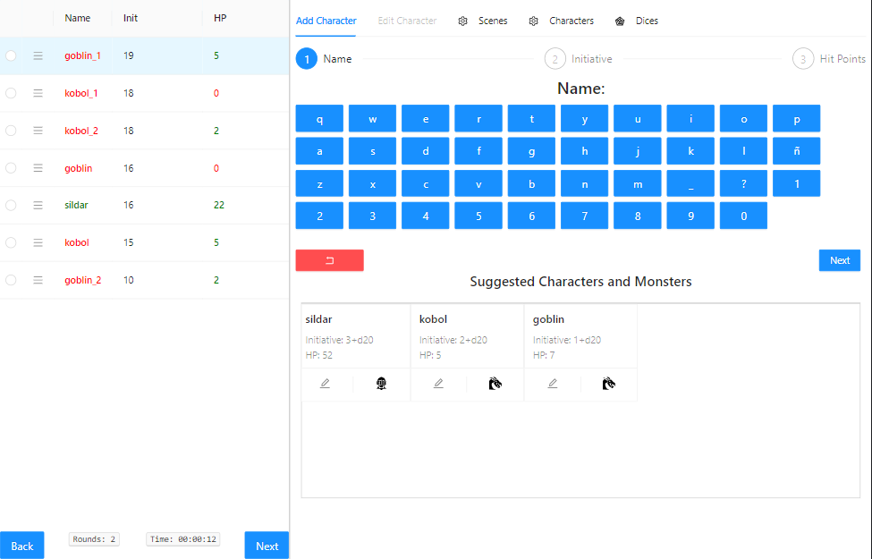
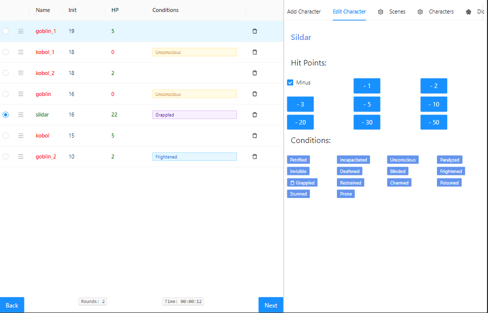
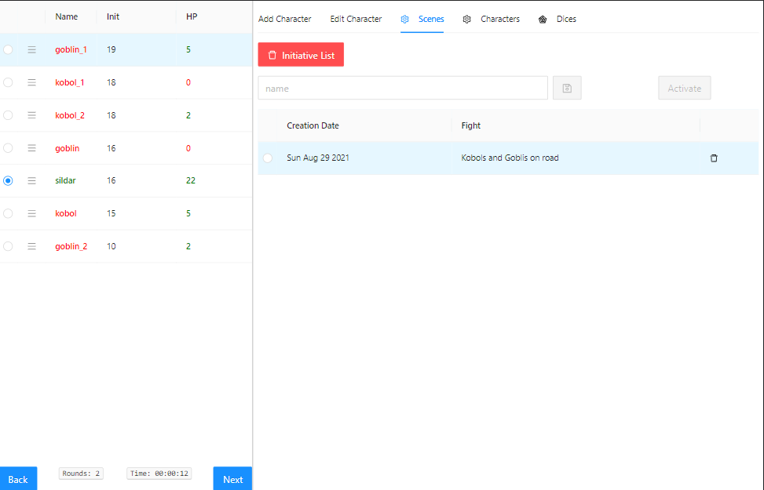
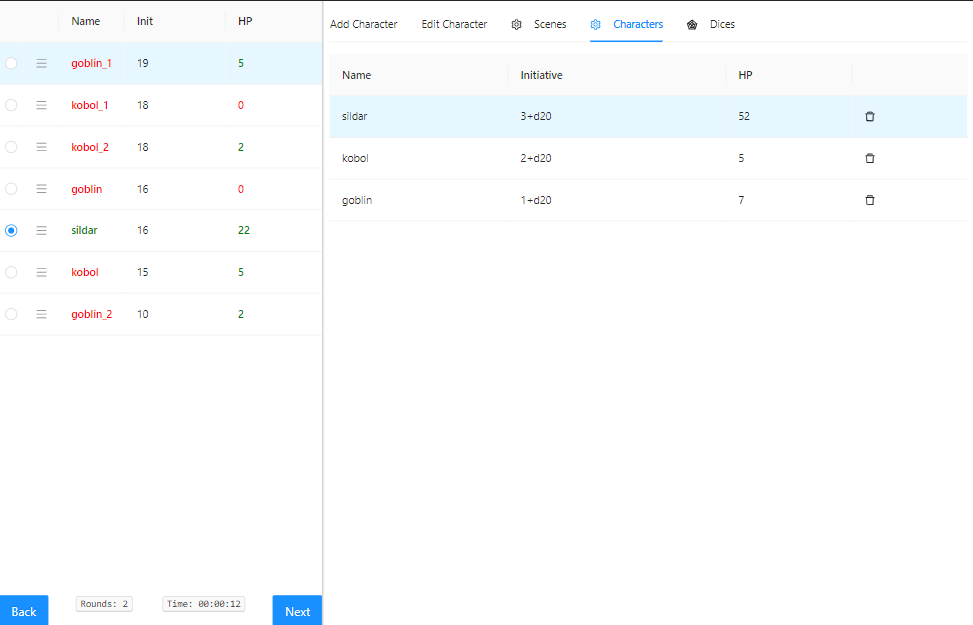
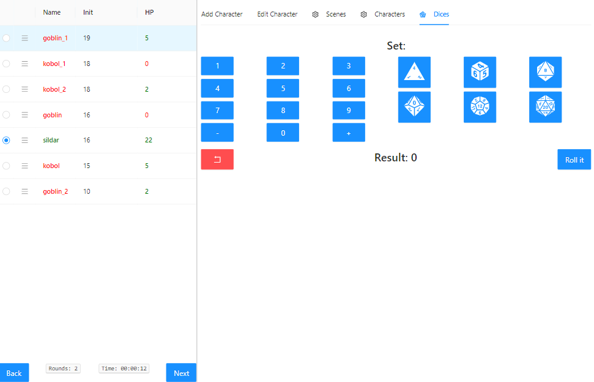

# [Combat Tracker](https://santiagoclv.github.io/dnd-combat-tracker) for TTRPG

Tracking combat initiative and HP from NPC could be cumbersome.

## Fetures

### Initiatives list always visible

* Initiative list.
* time and round trackers.
* Characters' hitpoints
* Quick add characters from suggested list

### Edit Characters on Combat

* Edit characters' hitpoints
* Edit characters' conditions

### Save/Load generated combat scenes

* Save initiative lists 
* Load initiative lists

### Saved generated characters list

* List of characters already created that will appear on Suggested Characters and Monsters

### Roll dices

* Roll sets of dice + modifiers

### Dice assets from [Game Icons](https://game-icons.net/)

### UI library - [Ant Design]()
